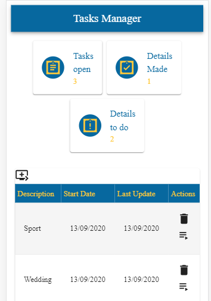
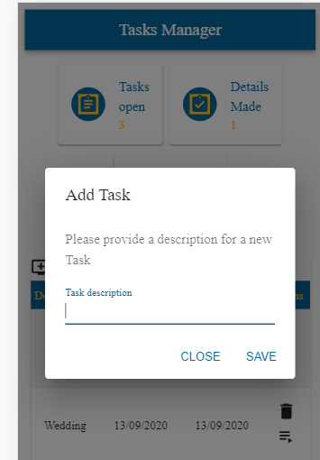
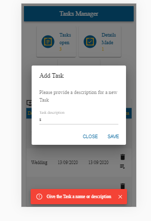
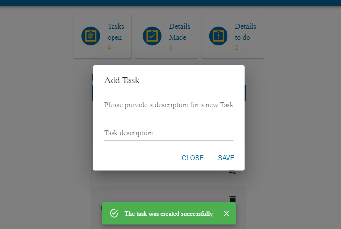
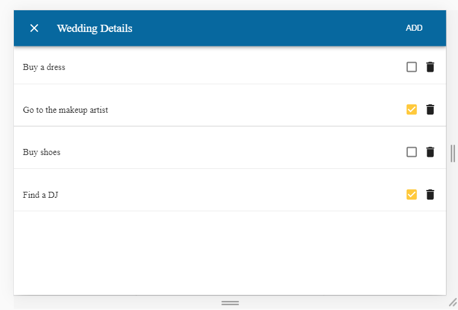

# TaskManager
Task management is mobile responsive-App.The app provide a  solution to Manage and organize your taskbar .

## Table Of Contents
- [TaskManager](#TaskManager)
  * [Running the project](#running-the-project)
  * [Screenshots](#Screenshots)
    + [Home page](#Home-page)
    + [Add Task](#Add-Task)
    + [Task Validation](#Task-Validation)
    + [Success Indication](#Success-Indication)
    + [Task Details](#Task-Details)
  * [Tech-Stack](#Techstack)
  * [To Do](#todo)

## Running the project

1. Clone the repo
2. Run npm install
3. Run npm run build
4. npm run dev
5. Navigate to http://localhost:3000

## Screenshots

### Home page
Home page of the app. At the top of the page - can distinguish three squares, each square gives a snapshot about - the total open tasks, completed deatails, and open details (data is updated in real time).
The table in the middle of the page shows the tasks info.
On the right there are two buttons - trash to delete the task, and an arrow to enter the details screen of each task.
To the left of the table is a button - to create a new task.

### Add Task
Clicking the Create New Task button will bring up a window for entering data and creating a new task.

### Task Validation 
An indication that you are exceeding the amount of tasks that can be created in the app.

### Success Indication
An indication that the data has been saved successfully.

### Task Details
A screen that displays all the details for a specific task, you can delete an item , add and mark as done .

## Techstack
1. Next.js,React,Mobx, Material-UI , Axios
2. Express (Node.js),MongoDb.

## To Do
1. Create a registration page - a multi-user application and each user has his own task manager.
2. Add fields to save additional data to tasks and details.
3. Create mission importance and alerts accordingly
4. In the details page give the option to build a plan in order from the first to the last detail.

